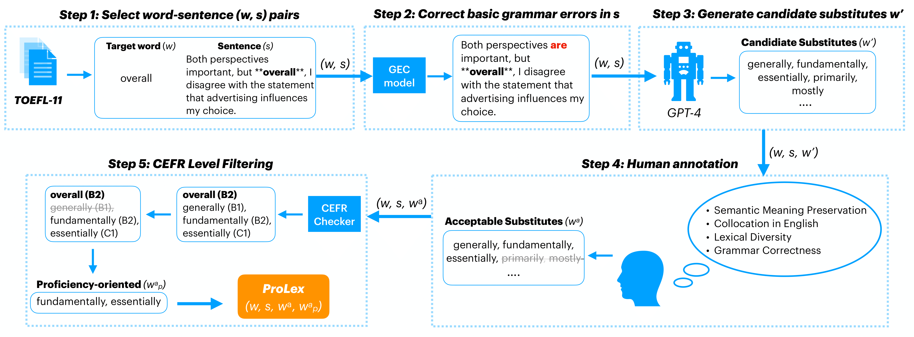

# ProLex ✍️: A Benchmark for Language Proficiency-oriented Lexical Substitution

This is the repository for ProLex, a novel benchmark that evaluates system performances on language proficiency-oriented lexical substitution, a new task that proposes substitutes that are not only contextually suitable but also demonstrate advanced-level proficiency. For example:

> **Target word** `w`: `promotion (B2)`
>
> **Context** `s`: `This **promotion** has a beautiful and effective visual part, but they miss the real point: the product.`
>
> **Acceptable** `w^a`: `advertising (A2), marketing (B1), publicity (B2), campaign (B1), advertisement (A2)`
>
> **Proficiency-oriented** `w^a_p`: `publicity (B2)`

Note that the proficiency level of each word is indicated based on [Common
European Framework of Reference (CEFR)](https://en.wikipedia.org/wiki/Common_European_Framework_of_Reference_for_Languages). We refer to the CEFR Checker developed by [Cathoven AI](https://www.cathoven.com/en/cefr-checker/) to label the CEFR level of each word in ProLex.

In general, this repository offers:

1. The data format (CSV) for ProLex ✍️
2. An instruction tuning pipeline with task-specific synthetic data
3. A standardized evaluation pipeline

## News
- [2024/01] 🔥 We released the very first version of ProLex. Read the [paper](https://arxiv.org/abs/2401.11356) for more details!

## Table of Contents
- [Downloading the ProLex benchmark](#downloading-the-prolex-benchmark)
- [Environment settings](#environment-settings)
- [Instruction finetuning pipelines](#instruction-finetuning-pipelines)
- [Evaluating on ProLex](#evaluating-on-prolex)
- [Citation](#citation)
- [Questions](#questions)

## Downloading the ProLex benchmark

## Environment settings

## Instruction finetuning pipelines

## Evaluating on ProLex

## Citation

## Questions
