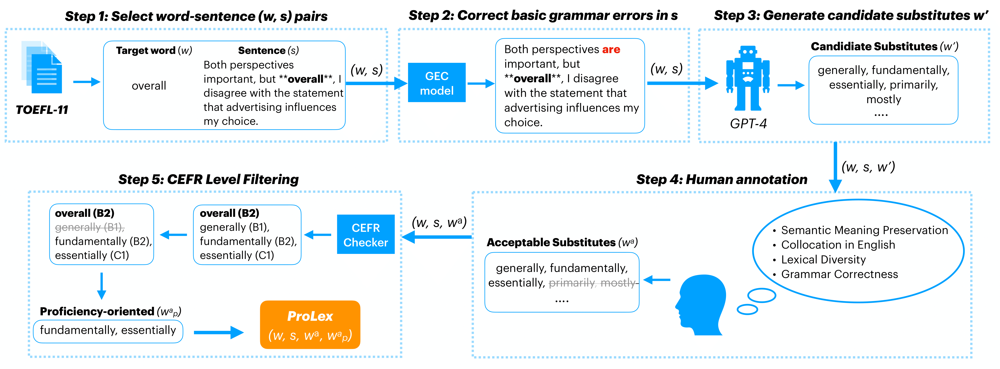

# ProLex ✍️: A Benchmark for Language Proficiency-oriented Lexical Substitution


This is the repository for ProLex, a novel benchmark that evaluates system performances on language proficiency-oriented lexical substitution, a new task that proposes substitutes that are not only contextually suitable but also demonstrate advanced-level proficiency. For example:

> **Target word** `w`: `promotion (B2)`
>
> **Context** `s`: `This **promotion** has a beautiful and effective visual part, but they miss the real point: the product.`
>
> **Acceptable** w<sup>a</sup>: `advertising (A2), marketing (B1), publicity (B2), campaign (B1), advertisement (A2)`
>
> **Proficiency-oriented** w<sup>a</sup><sub>p</sub>: `publicity (B2)`

Note that the proficiency level of each word is indicated based on [Common
European Framework of Reference (CEFR)](https://en.wikipedia.org/wiki/Common_European_Framework_of_Reference_for_Languages). We refer to the CEFR Checker developed by [Cathoven AI](https://www.cathoven.com/en/cefr-checker/) to label the CEFR level of each word in ProLex.

In general, this repository offers:

1. The data format (CSV) for ProLex ✍️
2. An instruction tuning pipeline with task-specific synthetic data
3. A standardized evaluation pipeline

## News
- [2024/01] 🔥 We released the very first version of ProLex. Read the [paper](https://arxiv.org/abs/2401.11356) for more details!


## Table of Contents
- [Downloading the ProLex benchmark](#downloading-the-prolex-benchmark)
- [Environment settings](#environment-settings)
- [Instruction-tuning pipelines](#instruction-tuning-pipelines)
- [Evaluating on ProLex](#evaluating-on-prolex)
- [Citation](#citation)
- [Questions](#questions)

## Downloading the ProLex benchmark
We prepare both the dev and test sets for ProLex ✍️. They can be downloaded from the following links:

- [ProLex development set](https://github.com/BillyZhang24kobe/LS_Proficiency/blob/main/data/dev/ProLex_v1.0_dev.csv)
- [ProLex test set](https://github.com/BillyZhang24kobe/LS_Proficiency/blob/main/data/test/ProLex_v1.0_test.csv)

### ProLex CSV format

ProLex is composed of quadruplets (w, s, w<sup>a</sup>, w<sup>a</sup><sub>p</sub>), each containing a target word, a context sentence, a list of acceptable substitutes, and a list of proficiency-oriented substitutes. We organize these contents into a CSV format. The columns are described as follows:

- `target word`: the target word as plain text.
- `Sentence`: the context sentence as plain text, with target word encompassed with asterisks.
- `acc_subs`: a list of acceptable substitutes annotated by human experts.
- `unacc_subs`: a list of unacceptable substitutes annotated by human experts.
- `prof_acc_subs`: a list of advanced proficiency-oriented substitutes from `acc_subs`.
- `prof_unacc_subs`: a list of low-proficiency substitutes removed from `acc_subs`.
- `t_words_cefr`: the CEFR level of the `target word`.
- `prof_acc_cefr`: the CEFR levels of the substitutes from `prof_acc_subs`.
- `prof_unacc_cefr`: the CEFR levels of the substitutes from `prof_unacc_subs`.

Note that we encoded the CEFR levels with integers ranging from 0 to 5. Please refer to the following mapping to derive the CEFR labels. Currently, there are some limitations of the CEFR checkers we are using. For example, it can not recognize certain words that are uncommon (e.g. gasoline). Also, it cannot recognize CEFR levels for phrases. However, to encourage vocabulary diversity of ProLex, we retain label `6` for accetapble but unknown words, and `None` for acceptable phrases, respectively.

```
0: A1
1: A2
2: B1
3: B2
4: C1
5: C2
6: unknown word
None: phrases
```

## Environment settings
### Conda environment installation
```
git clone git@github.com:BillyZhang24kobe/LS_Proficiency.git
cd LS_Proficiency
conda env create -f environment.yml
conda activate LS_prof
```

## Instruction-tuning pipelines
We provide scripts to synthesize task-specific training data with GPT-4, and then finetune `Vicuna-1.5` and `Llama 2` on top the synthetic data. Besides, according to CEFR, we also filter the dataset from [Swords](https://github.com/p-lambda/swords), which can also be used for training.

### Synthesize task-specific training data

#### With GPT-4
Get the synthetic data from GPT-4 with the following command. Note that you should create an `api_secrets.py` file in the root directory of the project, and input your OpenAI API credentials to the file before running the script.
```
python synthesize_train_gpt.py
```
Specifically, the script takes as an input the raw data from `data/raw/toefl_1500.csv`, which contains the sentences randomly selected from the `TOEFL-11` corpus. The output is store in `data/train/synthetic_gpt4.csv`.


#### Modified dataset from Swords
We take the dev and test set from [Swords](https://github.com/p-lambda/swords) and retrieve the CEFR labels of all target words and their corresponding acceptable substitutes (i.e. score greater than 50%). We remove the substitutes that demonstrate lower proficiency than the target words. The modified dataset can be downloaded [here](https://github.com/BillyZhang24kobe/LS_Proficiency/blob/main/data/train/swords_filtered.csv).

### Instruction-tuning recipes

### Model Weights
#### Vicuna-1.5 Weights
| Size | Description | Hugging Face Repo |
| ---  | --- | --- |
| 7B   | `python3 -m fastchat.serve.cli --model-path lmsys/vicuna-7b-v1.5`  | [lmsys/vicuna-7b-v1.5](https://huggingface.co/lmsys/vicuna-7b-v1.5)   |
| 7B-D<sub>LS</sub>   | `python3 -m fastchat.serve.cli --model-path lmsys/vicuna-7b-v1.5-16k`  | [lmsys/vicuna-7b-v1.5-16k](https://huggingface.co/lmsys/vicuna-7b-v1.5-16k)   |
| 13B  | `python3 -m fastchat.serve.cli --model-path lmsys/vicuna-13b-v1.5` | [lmsys/vicuna-13b-v1.5](https://huggingface.co/lmsys/vicuna-13b-v1.5) |
| 13B-D<sub>LS</sub> | `python3 -m fastchat.serve.cli --model-path lmsys/vicuna-13b-v1.5-16k` | [lmsys/vicuna-13b-v1.5-16k](https://huggingface.co/lmsys/vicuna-13b-v1.5-16k) |

#### Llama-2 Weights
| Size | Description | Hugging Face Repo |
| ---  | --- | --- |
| 7B   | `python3 -m fastchat.serve.cli --model-path lmsys/vicuna-7b-v1.5`  | [lmsys/vicuna-7b-v1.5](https://huggingface.co/lmsys/vicuna-7b-v1.5)   |
| 7B-D<sub>LS</sub>   | `python3 -m fastchat.serve.cli --model-path lmsys/vicuna-7b-v1.5-16k`  | [lmsys/vicuna-7b-v1.5-16k](https://huggingface.co/lmsys/vicuna-7b-v1.5-16k)   |
| 13B  | `python3 -m fastchat.serve.cli --model-path lmsys/vicuna-13b-v1.5` | [lmsys/vicuna-13b-v1.5](https://huggingface.co/lmsys/vicuna-13b-v1.5) |
| 13B-D<sub>LS</sub> | `python3 -m fastchat.serve.cli --model-path lmsys/vicuna-13b-v1.5-16k` | [lmsys/vicuna-13b-v1.5-16k](https://huggingface.co/lmsys/vicuna-13b-v1.5-16k) |


## Evaluating on ProLex

## Citation
We highly appriciate your interests in our work. If you find ProLex ✍️  helpful, please consider citing our paper in your work:

```
@article{zhang2024prolex,
  title={ProLex: A Benchmark for Language Proficiency-oriented Lexical Substitution},
  author={Zhang, Xuanming and Chen, Zixun and Yu, Zhou},
  journal={arXiv preprint arXiv:2401.11356},
  year={2024}
}
```

## Questions
Please reach out to us at billyzhang@cs.columbia.edu if you have any questions in using our benchmark. If you find an issue in either the source code or dataset, please feel free to create a pull request and make contribution to the benchmark!